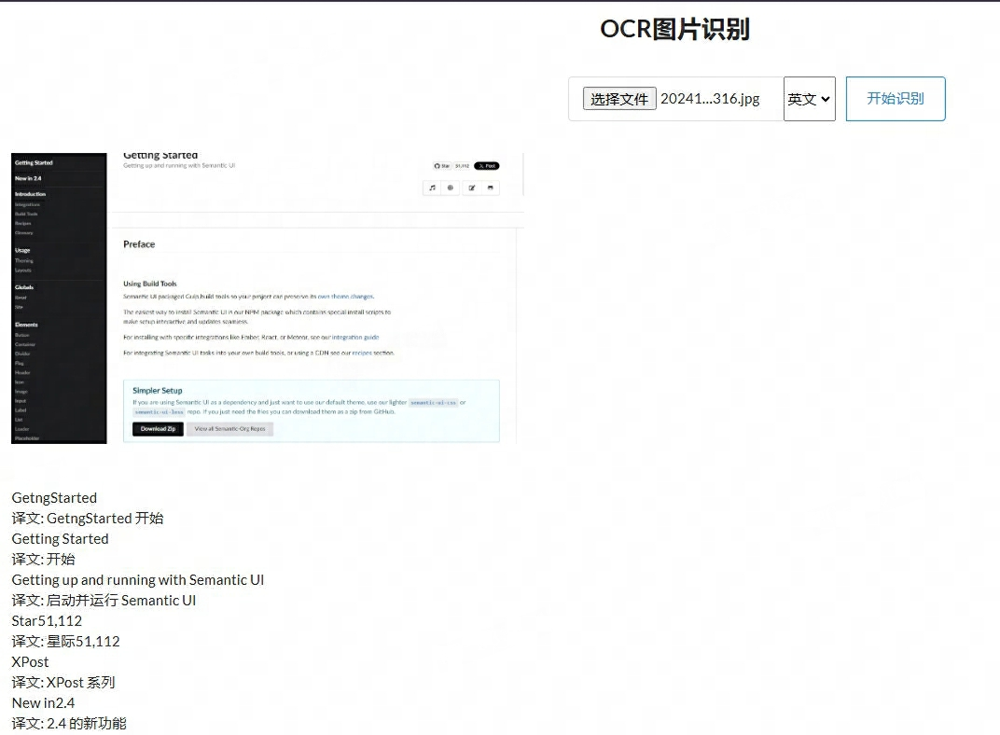

# OCR翻译



### Requirements
```
pip install paddlepaddle
pip install paddleocr
pip install uwsgi
```

### Introduction
基于bottle框架开发，使用python3环境运行，调用paddlepaddle ocr模型，识别图片中的文字，调用bing翻译服务，将识别的文字进行翻译

paddleOCR文档：https://paddlepaddle.github.io/PaddleOCR/latest/index.html

### run
```
uwsgi --ini uwsgi.ini
```
